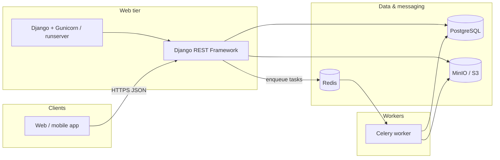

# MovieHub

MovieHub is a Django REST API backend for a streaming-style catalog: user accounts with JWT auth, movies and metadata, watchlists and progress, semantic search via embeddings, and background jobs for email and ML workloads.

Formatting in this file follows [GitHub basic writing and formatting syntax](https://docs.github.com/en/get-started/writing-on-github/getting-started-with-writing-and-formatting-on-github/basic-writing-and-formatting-syntax).

---

## Table of contents

- [Features](#features)
- [Backend architecture](#backend-architecture)
- [Data stores](#data-stores)
- [Project layout](#project-layout)
- [Prerequisites](#prerequisites)
- [Setup](#setup)
- [Running the stack](#running-the-stack)
- [Environment variables](#environment-variables)
- [API overview](#api-overview)
- [Useful commands](#useful-commands)
- [Further notes](#further-notes)

---

## Features

- **Users** — Registration, email verification, JWT login, profile, password reset
- **Content** — Movies, genres, actors, watchlist, watch history / continue watching
- **Search & recommendations** — Semantic search and similar movies (embeddings in PostgreSQL)
- **Async work** — Celery workers for emails, embedding generation, and similar tasks
- **Media** — S3-compatible storage (MinIO locally; AWS S3 in production with the same settings)

---

## Backend architecture

The API is a classic **Django + DRF** web process. Long-running or slow work is **queued to Celery**; durable data lives in **PostgreSQL**; **Redis** carries Celery messages; **MinIO** holds uploaded media.



| Layer | Responsibility |
| --- | --- |
| **HTTP (Django / DRF)** | Routing, auth (Simple JWT), validation, serializers, throttling |
| **Service layer** | `apps.users.services`, `apps.content.services` — business logic and transactions |
| **Signals & tasks** | Post-save hooks; Celery tasks in `apps.users.tasks`, `apps.content.tasks` |
| **Integrations** | TMDB import (`import_tmdb_movies`), FastEmbed for vectors, `django-storages` + boto3 for objects |

**Authentication flow (summary):** clients send `Authorization: Bearer <access_token>`; DRF’s `JWTAuthentication` validates the token, loads the user from PostgreSQL, and sets `request.user`.

---

## Data stores

MovieHub does **not** use a single database. Each store has a specific role:

| Store | Engine / image | Used for | Config / notes |
| --- | --- | --- | --- |
| **PostgreSQL** | `postgres:15` (`moviehub-postgres`) | Primary **relational** database | `DATABASES` in `config/settings.py` — users, profiles, movies, genres, actors, M2M tables, watchlist, watch history, **`django_celery_results` task results** |
| **Redis** | `redis:7` (`moviehub-redis`) | **Celery broker** (task queue) | `CELERY_BROKER_URL` — default logical DB `0` (`redis://host:port/0`) |
| **MinIO** | `minio/minio` | **Object storage** (S3 API) | Videos and file uploads via `django-storages`; bucket name `AWS_STORAGE_BUCKET_NAME` |
| **Local disk** | Project directories | Dev-only / cache | `media/` (when not using S3), `huggingface_cache/` for embedding model files (`FASTEMBED_CACHE_DIR`) |

### PostgreSQL (application schema)

| Area | Apps / models | Examples |
| --- | --- | --- |
| Identity | `apps.users` | Custom `User`, `UserProfile` |
| Catalog | `apps.content` | `Movie`, `Genre`, `Actor` |
| Engagement | `apps.content` | `Watchlist`, `WatchHistory` |
| Search (phase 1) | `Movie.embedding` | JSON array of floats (cosine similarity in app code) |
| Celery | `django_celery_results` | Stored task outcomes when `CELERY_RESULT_BACKEND=django-db` |

SQLite appears only as a **commented** alternative in `config/settings.py`; the running project expects PostgreSQL.

### Redis

- **Today:** Celery message broker only (`CELERY_BROKER_URL`).
- **Planned / documented patterns:** response caching, rate-limit counters, session cache, trending snapshots — see comments in `apps/content/views.py` and [Further notes](#further-notes).

> **Port alignment:** Docker maps Redis to a **host** port (see `REDIS_PORT` in `.env`). `CELERY_BROKER_URL` must use that same host port (for example `redis://localhost:6333/0` if `REDIS_PORT=6333`).

### MinIO (S3-compatible)

- **Endpoint:** `AWS_S3_ENDPOINT_URL` (default `http://localhost:9000`)
- **Console:** `MINIO_CONSOLE_PORT` (default `9001`) — create the bucket named in `AWS_STORAGE_BUCKET_NAME` before uploading videos
- **Production:** point the same variables at AWS S3 (or another S3-compatible provider)

### Embeddings & scale (roadmap)

| Phase | Storage | Search |
| --- | --- | --- |
| **Current** | PostgreSQL `Movie.embedding` (JSONField) | Linear scan + cosine similarity in Python |
| **Later** | Dedicated vector index (e.g. FAISS, Pinecone, Weaviate) | Approximate nearest neighbor (ANN) at large catalog size |

---

## Project layout

```text
moviehub/
├── config/              # Django settings, URLs, Celery app
├── apps/
│   ├── users/           # Auth, profile, email flows
│   └── content/         # Movies, watchlist, search, TMDB import
├── templates/
├── docker-compose.yml   # PostgreSQL, Redis, MinIO
├── requirements.txt
├── manage.py
└── .env.example         # Copy to .env and adjust
```

---

## Prerequisites

- **Python** 3.12 (see `.python-version`)
- **Docker** and **Docker Compose** (for PostgreSQL, Redis, MinIO)
- **Git**

Optional:

- [TMDB](https://www.themoviedb.org/settings/api) API key / access token for `import_tmdb_movies`
- `psql` client (see `commands.md` for PostgreSQL cheatsheet)

---

## Setup

### 1. Clone and enter the repo

```bash
git clone <your-repo-url> moviehub
cd moviehub
```

### 2. Python virtual environment

```bash
python3.12 -m venv .venv
source .venv/bin/activate
pip install -r requirements.txt
```

### 3. Environment file

```bash
cp .env.example .env
```

Edit `.env`:

- Set **`DJANGO_SECRET_KEY`** for anything beyond local dev.
- Match **`DB_PORT`**, **`REDIS_PORT`**, and **`CELERY_BROKER_URL`** to the ports Docker publishes on your machine.
- Add **`TMDB_ACCESS_TOKEN`** / **`TMDB_API_KEY`** only if you import from TMDB.
- Never commit real secrets; keep them in `.env` only.

### 4. Start infrastructure

```bash
docker compose up -d
```

This starts:

| Service | Container | Default host ports (override via `.env`) |
| --- | --- | --- |
| PostgreSQL | `moviehub-postgres` | `DB_PORT` → 5432 |
| Redis | `moviehub-redis` | `REDIS_PORT` → 6379 |
| MinIO | `moviehub-minio` | API `9000`, console `9001` |

### 5. MinIO bucket

MinIO does not create buckets by itself. In `DEBUG`, Django creates **`AWS_STORAGE_BUCKET_NAME`** (default `mybucket`) on first upload if it is missing.

To create it manually: open `http://localhost:9001` (or your `MINIO_CONSOLE_PORT`), log in with `AWS_ACCESS_KEY_ID` / `AWS_SECRET_ACCESS_KEY`, and create a bucket with that name.

### 6. Django database migrations

```bash
python manage.py migrate
python manage.py createsuperuser   # optional, for /admin/
```

### 7. (Optional) Import sample movies from TMDB

```bash
python manage.py import_tmdb_movies
```

Requires valid TMDB credentials in `.env`.

---

## Running the stack

Run these in **separate terminals** (with the venv activated):

| Process | Command |
| --- | --- |
| API | `python manage.py runserver` |
| Celery worker | `celery -A config worker -l info` |

Optional concurrency:

```bash
celery -A config worker --concurrency=4 -l info
```

Development email uses the **console backend** (`EMAIL_BACKEND` in settings) — verification and reset links are printed in the terminal, not sent over SMTP.

**Health check:** API root is under `/api/` (for example `GET /api/movies/`). Admin: `/admin/`.

---

## Environment variables

| Variable | Purpose |
| --- | --- |
| `DJANGO_SECRET_KEY` | Signing (JWT, sessions, tokens) |
| `DJANGO_DEBUG` | Debug mode (`true` / `false`) |
| `DJANGO_ALLOWED_HOSTS` | Comma-separated hosts when `DEBUG` is false |
| `DB_NAME`, `DB_USER`, `DB_PASSWORD`, `DB_HOST`, `DB_PORT` | PostgreSQL |
| `REDIS_PORT` | Host port for Redis container |
| `CELERY_BROKER_URL` | Redis URL for Celery (must match host Redis port) |
| `CELERY_RESULT_BACKEND` | Typically `django-db` (results in PostgreSQL) |
| `DOMAIN`, `DEFAULT_FROM_EMAIL` | Links in verification / reset emails |
| `AWS_*` | MinIO / S3 credentials and bucket |
| `MINIO_API_PORT`, `MINIO_CONSOLE_PORT` | Docker port mappings |
| `CORS_ALLOWED_ORIGINS` | Frontend origins (CORS + CSRF trusted origins) |
| `THROTTLE_RATE_USER`, `THROTTLE_RATE_ANON`, `THROTTLE_RATE_AUTH` | DRF rate limits (default `300/min`, `120/min`, `20/min`) |
| `THROTTLE_DISABLE_IN_DEBUG` | When `true` (default), no global API throttling while `DJANGO_DEBUG=true` |
| `TMDB_API_KEY`, `TMDB_ACCESS_TOKEN` | TMDB import |
| `FASTEMBED_CACHE_DIR` | On-disk cache for embedding models |

Full template: [`.env.example`](.env.example).

---

## API overview

Base path: **`/api/`** (users under **`/api/users/`**).

### Users (`/api/users/`)

| Method | Path | Description |
| --- | --- | --- |
| POST | `register/` | Create account |
| GET | `verify-email/<uid>/<token>/` | Confirm email |
| POST | `login/` | Obtain JWT pair |
| GET/PATCH | `profile/` | Current user profile |
| POST | `forgot-password/` | Request reset |
| POST | `reset-password/<uid>/<token>/` | Set new password |

JWT refresh: `POST /api/token/refresh/`

### Content (`/api/`)

| Method | Path | Description |
| --- | --- | --- |
| GET | `movies/` | List / filter / search movies |
| GET | `movies/<id>/` | Movie detail |
| GET | `movies/semantic-search/` | Embedding-based search |
| GET | `movies/<id>/similar/` | Similar movies |
| * | `watchlist/`, `watchlist/list/`, `watchlist/<id>/` | Watchlist CRUD |
| * | `progress/`, `continue/` | Playback progress |

Use `apitest.http` in the repo root for example requests if present.

---

## Useful commands

```bash
# Migrations
python manage.py makemigrations
python manage.py migrate

# Shell
python manage.py shell_plus   # requires django-extensions

# Celery (same as above)
celery -A config worker -l info
```

PostgreSQL CLI examples: [`commands.md`](commands.md).

---

## Further notes

Longer architecture walkthroughs (JWT lifecycle, password-reset tokens, Celery/Redis patterns, MinIO upload flows, recommendation types) are kept in [`readme_copy.md`](readme_copy.md) as supplementary learning material.

When you change behavior or add endpoints, update this README and `.env.example` together so new developers can still bring the stack up with one compose file and one env template.

### Frontend (`moviehub-web`)

The web UI lives in **`../moviehub-web`** (sibling folder under the same `moviehub/` workspace). It talks to this API over JSON + JWT. Configure `CORS_ALLOWED_ORIGINS` and optionally set `DOMAIN` to the frontend base URL (e.g. `http://localhost:5173`) for verification links.
